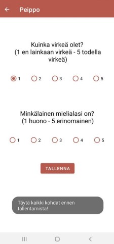
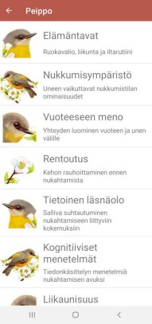

# Peippo: Sleep and Mood Tracking App

Used tools & technologies:
- Java
- Android Studio
- Shared Preferences API

Peippo is an application designed for tracking your sleep and mood. By providing information about your sleep patterns, the app offers personalized recommendations to enhance your well-being. Additionally, Peippo provides valuable insights and tips for achieving better sleep.

